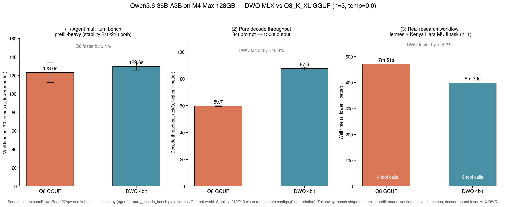

# Qwen3.6-35B-A3B: DWQ MLX vs Q8_K_XL GGUF — multi-axis benchmark

**Date**: 2026-04-18 (updated with n=3 + flat control + pure decode + real research workflow)
**Hardware**: Apple M4 Max, 128GB unified memory
**Methodology**: Replicates [mlx-lm issue #1011](https://github.com/ml-explore/mlx-lm/issues/1011) on the newer Qwen3.6 generation, extended with three additional axes.



## TL;DR (revised)

The original single-run post claimed DWQ is 40% faster than Q8_K_XL GGUF. Follow-up n=3 + obs-equalized measurement shows **the speed story depends on workload shape**:

- **Multi-turn agent bench (prefill-heavy)** → Q8 GGUF is ~5% faster. llama.cpp's Metal prefill kernels win when history accumulates.
- **Pure decode (84t prompt → 1500t output)** → **DWQ is 47% faster** (87.6 vs 59.7 tok/s). The original headline is valid here.
- **Real research workflow (Hermes + Kenya Hara MUJI task, real web search)** → **DWQ is 15% faster wall-clock, with 36% fewer tool calls to reach the same output quality** (9 vs 14).

**Stability: both configurations are 70/70 clean across n=3 (210/210 rounds, 0 degradation, 0 empty-response).** The DWQ distillation-based calibration fully contains the MoE gate quantization issue that #1011 reported for flat 4/8-bit MLX. A flat 4-bit Qwen3.6 control run also did not classic-degrade (Qwen3.6 base is more robust than Qwen3.5), but showed 1 empty-response soft-miss in 70 rounds that DWQ did not.

## Results

### Axis 1 — Multi-turn tool-calling bench (prefill-heavy agent harness)

| Config | Runs | Rounds clean | Soft-miss (tc=0) | Tool calls | Avg wall time |
|---|---|---|---|---|---|
| Q8_K_XL GGUF (llama-server, `--jinja`, `preserve_thinking`) | **3** | **210/210** | 0 | 70/70/70 | **123.0s** |
| 4-bit DWQ MLX (mlx_lm.server) | **3** | **210/210** | 0 | 73/73/73 | 129.5s (warm runs 2+3) |
| 4-bit flat MLX (control) | 1 | 70/70 | **1** (R16 empty+finish=stop) | 74 | 100.2s |

### Axis 2 — Pure decode throughput (streaming)

Fixed 84-token prompt, 1500-token output ceiling, streaming mode, n=3 each:

| Config | Decode tok/s (n=3) | Time per 1500 tok |
|---|---|---|
| Q8_K_XL GGUF | 59.27 / 59.95 / 59.74 (avg **59.65**) | 25.1s |
| **4-bit DWQ MLX** | 86.07 / 88.49 / 88.11 (avg **87.56**) | **17.1s** |

DWQ: **+46.8% decode throughput**, very tight variance (±1.2 tok/s).

### Axis 3 — Real research workflow via Hermes Agent

Task: "Research Kenya Hara's MUJI aesthetics and 'white' philosophy. Search for 3 post-2024 interviews / exhibition reviews / essays. Write 150 Chinese words of analysis per source with URL citation. Close with a 100-word opening hook summarizing the core proposition. Budget 30 tool calls."

Same Hermes coder profile, same MCP stack (camoufox + fetch + sequential), same web_search provider (Brave via AI Gateway). Only backend swapped via `base_url`.

| Config | Wall time | Tool calls | Peak prompt | Final output tokens | Output quality |
|---|---|---|---|---|---|
| Q8_K_XL GGUF | 7m 51s | 14 | 75.3K | 855 | 3 sources + hook ✓ |
| **4-bit DWQ MLX** | **6m 39s** | **9** | 69.3K | 512 | 3 sources + hook ✓ |

DWQ finished **-15.3% wall-clock**, used **-35.7% fewer tool calls**, and hit the same deliverable quality. The decode-speed advantage lets DWQ write more comprehensively per turn — fewer short back-and-forth rounds.

## Why the axes disagree

`bench.py` is deliberately a loop of short completions (~100 tokens per round) against a growing history (up to ~20K accumulated). That is a prefill-bound regime where llama.cpp Metal's kernel-fused attention + highly-optimized KV cache handling has a genuine edge.

`pure_decode_bench.py` isolates generation throughput and shows MLX's decode advantage clearly.

The real research workflow is a mixed regime, and it happens to reward decode throughput more than prefill (per-turn outputs are 200-500 tokens, agent often writes multi-paragraph analysis per round). So DWQ wins the end-to-end metric that users actually care about, even though the single-axis agent bench suggested otherwise.

**Takeaway**: a single benchmark shape can mislead. Always measure the workload you actually run.

## Method

All three axes use `temperature=0.0` for determinism. Code + full logs:

- `bench.py` — multi-turn agent harness (5 fake tools, deterministic responses)
- `pure_decode_bench.py` — OpenAI-compatible streaming, measures tok/s from elapsed + usage
- Real research: Hermes CLI (`hermes chat -q "..."` with `--max-turns 40 -v`), logs in separate `/tmp/q8_research.log` and `/tmp/dwq_research.log`
- `make_charts.py` — generates `results_comparison.png`

Reproduction:

```bash
# Terminal 1: Q8_K_XL GGUF
llama-server -m /path/to/Qwen3.6-35B-A3B-UD-Q8_K_XL.gguf \
  --jinja --chat-template-kwargs '{"preserve_thinking":true}' \
  --port 8810 -c 262144 --temp 0.0

# Terminal 2: DWQ MLX
uv run mlx_lm.server --model mlx-community/Qwen3.6-35B-A3B-4bit-DWQ \
  --host 127.0.0.1 --port 8811

# Terminal 3: agent bench (n=3 each, alternate endpoints)
for i in 1 2 3; do
  uv run python bench.py \
    --endpoint "q8_run${i}=http://127.0.0.1:8810/v1|qwen3.6-q8kxl" \
    --rounds 70 --out "results_q8_run${i}.json"
  uv run python bench.py \
    --endpoint "dwq_run${i}=http://127.0.0.1:8811/v1|mlx-community/Qwen3.6-35B-A3B-4bit-DWQ" \
    --rounds 70 --out "results_dwq_run${i}.json"
done

# Terminal 4: pure decode (3 runs per endpoint, all in one invocation)
uv run python pure_decode_bench.py \
  --endpoint "dwq=http://127.0.0.1:8811/v1|mlx-community/Qwen3.6-35B-A3B-4bit-DWQ" \
  --endpoint "q8=http://127.0.0.1:8810/v1|qwen3.6-q8kxl" \
  --runs 3 --max-tokens 1500

# Chart
uv run python make_charts.py
```

## Caveats

- **M4 Max** results. M5 with Neural Accelerators likely widens MLX's decode advantage further (Ollama 0.19 reports ~93% decode speedup on M5 for Qwen3.5 NVFP4).
- **Real research run is n=1** per config. Wall-clock has real-world variance from Brave API latency and Crawl4AI page size differences. The 15% wall-clock gap is larger than typical network noise, but a rigorous follow-up would run n≥3 with fixed tool responses.
- **Vision asymmetry**: Q8_K_XL GGUF ships with `mmproj-F16` for multimodal. DWQ MLX has no mmproj pairing, so a profile that truly replaces Q8 with DWQ loses vision capability unless a separate llama-server is run as `auxiliary.vision` backend (which gives back the RAM savings).
- **Long-context stress test (>100K prompt) has not been run** for either configuration. All tests here stayed under ~20K accumulated context.
- **n=3 stability is on synthetic bench only**. Real research workload stability (error recovery, malformed tool responses, long multi-step chains) should be validated with a daily-drive evaluation period.
- **Qwen3.6 flat 4-bit control**: did not exhibit the classic issue #1011 degradation signature (no prose-as-tool-call leaks), but `bench.py`'s leak detector missed an empty-response soft-miss at round 16 — inspect `results_flat4bit.json` for `num_tool_calls=0` rounds.

## Credits

- DWQ technique by [Prince Canuma (@Prince_Canuma)](https://x.com/Prince_Canuma/status/1978581825615216712) and the mlx-lm team
- Qwen3.6 by the Alibaba Qwen team
- Unsloth UD quant scheme (GGUF side) by Unsloth.AI
- Issue #1011 original reporter: [LotusDecoder](https://github.com/ml-explore/mlx-lm/issues/1011)
